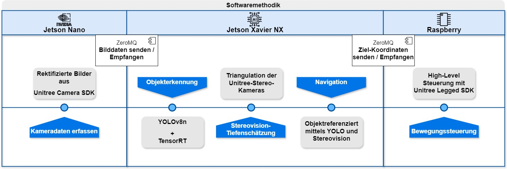

Introduction
---

Dieses Projekt baut auf dem Unitree Camera SDK auf, das unter der Mozilla Public License 2.0 veröffentlicht wurde. Der vorhandene Quellcode wurde erweitert und angepasst, um neue Funktionalitäten zu realisieren.

Ziel dieses Projekts ist es, den Go1-Roboter von Unitree mit einem Echtzeit-Objekterkennungs- und Verfolgungssystem auszustatten. Dabei erkennt der Roboter bestimmte Objekte (z.B. Flaschen), bestimmt ihre Entfernung mittels der integrierten Stereokameras und steuert anschließend auf das nächste Ziel zu, bis ein definierter Sicherheitsabstand erreicht ist. Dieser Abstand wird dann dynamisch gehalten.

🧭 1. Overview
---

Dieses Verzeichnis stellt den vollständigen Software-Stack zur Verfügung, um den Go1-Roboter für folgende Aufgaben vorzubereiten:

- **Objekterkennung** mittels YOLOv8n-Engine-Model (Inference optimiert mit TensorRT für maximale Performance auf Jetson-Plattformen)
- **Tiefenmessung** via Disparitätsberechnung mittels kalibrierten Stereokameras (ermöglicht Distanzberechnungen zu erkannten Objekten)
- **Zielverfolgung** durch Navigation bis zum Objekt mit aktivem Abstandsregler
- **Modulare Architektur** mit ZeroMQ für die Bildübertragung zwischen Kamera-Head (Jetson Nano), Verarbeitungseinheit (Xavier NX) und Durchführungseinheit (Raspberry Pi)

Das System wurde für ressourcenbeschränkte Edge-Hardware wie den Jetson Xavier NX optimiert und unterstützt optimierte Objekterkennungs-Modelle über TensorRT. Die Input-Shape (width, height) nahe an RectFrame-Size der Go1 Kamera angepasst und YOLO-Kompatibel (teilbar durch 32).

🔗 2. Architekturüberblick
---
Diese Abbildung zeigt die modulare Systemarchitektur verteilt auf die drei Recheneinheiten (diese sind im src-Verzeichnis voneinander getrennt):

<p align="center">
  
  <br/>
  <em>Abbildung 1: Architekturdiagramm des Go1-Stacks</em>
</p>

🔧 3. Build-Time Dependencies (für Modellkonvertierung auf Host/XavierNX, Python 3.8)
---

- [Python3.8+](https://linuxize.com/post/how-to-install-python-3-8-on-ubuntu-18-04/) - erforderlich für ultralytics
- [Ultralytics](https://docs.ultralytics.com/de/quickstart/) - zum Laden und Exportieren von YOLO .pt-Modellen in .onnx
- [PyTorch](https://docs.ultralytics.com/de/guides/nvidia-jetson/#install-pytorch-and-torchvision) – automatisch mit ultralytics installiert (nur x86-kompatibel, nicht direkt auf Jetson)
- ONNX, ONNX-Simplifier – für ONNX-Export, falls simplify=True
- trtexec - CLI-Tool aus dem NVIDIA TensorRT Toolkit (.onnx → .engine, i. d. R. unter /usr/src/tensorrt/bin/trtexec)

🚀 4. Runtime Dependencies
---

(auf Jetson Go1, Python ≥3.6)
- OpenCV (≥4) - für Bildverarbeitung
- CMake (≥3.27.9) - zum bauen von C-Anwendungen / Installation von cppzmq-Header-Paket (nötiges C++-Binding für ZeroMQ)
- Python3.6+
- [ZeroMQ](https://zeromq.org/get-started/) - leichtgewichtige Messaging-Library (Bildstreaming Nano → Xavier NX → Raspberry Pi)
  
**Nur auf Xavier NX erforderlich (für Objekterkennung):**


- [TensorRT](https://developer.nvidia.com/tensorrt) - NVIDIA-Inferenz-Bibliothek, die speziell für NVIDIA GPUs die maximale Inferenz-Performance aus ONNX-Modellen herausholt (z. B. Version 7.1.3.0 unter JetPack 4.5)
- [PyCUDA](https://wiki.tiker.net/PyCuda/Installation/Linux/) – für Memory Binding, CUDA Streams mit TensorRT & Speicherverwaltung in GPU

📊 5. Performance & Benchmarks
---

Die Performance wurde auf dem **Jetson Xavier NX** gemessen mit verschiedenen YOLOv8-Modellvarianten. Alle Tests nutzen **TensorRT-Inference** für optimale Geschwindigkeit.

### Modell-Vergleich (Xavier NX mit TensorRT)

| YOLO-Modell | Inference (FPS) | mAP₀.₅ | mAP₀.₅:₀.₉₅ | Bemerkung |
|-------------|-----------------|--------|------------|-----------|
| **8n** | 24,47 | 0,0994 | 0,0666 | ⭐ Höchste FPS, gute Effizienz |
| **8s** | 24,2 | 0,1058 | 0,065 | 📈 Höchste Genauigkeit |
| **11n** | 24,4 | 0,079 | 0,0508 | Geringere Genauigkeit |
| **11s** | 23,87 | 0,076 | 0,0505 | Etwas langsamer als 8n |
| **8n (fine-tuned)** | 24,4 | **0,9848** | **0,8789** | 🎯 Fine-tuned auf Anwendungsdaten |

**Empfehlungen:**
- **Produktiv (Flaschen-Tracking)**: Fine-tuned YOLOv8n (mAP 0,98 - optimal für Anwendungsfall)
- **Allgemein**: YOLOv8n (schnell & zuverlässig)
- **High-Accuracy**: YOLOv8s (leicht bessere Genauigkeit, minimal langsamer)

**Performance-Analyse:**

Die Bildrate reduziert sich während der Datenübertragung, Objekterkennung und Tiefenschätzung von ursprünglich **27 FPS auf etwa 23 FPS** (nach Datenübertragung, Objekterkennung und Tiefenschätzung). Dieser Verlust von ~15% liegt im akzeptablen Bereich und gewährleistet die **Echtzeitfähigkeit des Systems**.

### Praktische Ergebnisse in Aktion

Das System erkennt Objekte zuverlässig und schätzt ihre Entfernung mittels Stereovision:

<p align="center">
  
  <br/>
  <em>Abbildung 1: Architekturdiagramm des Go1-Stacks</em>
</p>

<p align="center">
  
  <br/>
  <em>Abbildung 2: Live-Demo - Objekterkennung (grün/blau) mit Tiefenschätzung in Millimetern</em>
</p>

**Erkenntnisse aus der Demo:**
- ✅ **Mehrfach-Objekterkennung**: Es werden mehrere Flaschen erfasst
- ✅ **Echtzeit-Tiefenschätzung**: Entfernungen werden live in Millimeter angezeigt
- ✅ **Stereo-Disparität**: Unterschiedliche Abstände zwischen linkem (grün) und rechtem (blau) Bild sichtbar
- ✅ **Robuste Erkennung**: Funktioniert auch unter variablen Lichtverhältnissen (Indoorbeleuchtung)

**Farbcodierung:**
- 🟢 **Grün**: Detektionen aus linker Kamera
- 🔵 **Blau**: Detektionen aus rechter Kamera
- **Zahlen**: Objekt-ID und Entfernung in Millimeter

📁 6. Build 
---

🔨 Bauen der C++-Anwendung auf dem Jetson Nano
```
cd Go1ObjectTracking;
mkdir build && cd build;
cmake ..;
make
```

🏃 7. Run
---

🎥 Kamera-Prozesse prüfen (Jetson Nano)
```
v4l2-ctl --list-devices;
lsof /dev/video1;
kill -9 <PID>   # falls erforderlich
```

📤 ***Frames an Xavier NX senden:***
```
cd Go1ObjectTracking; 
./bin/send_perception
```

🏁 ***Hauptprogramm auf dem Xavier NX starten:***

🔎 **Grafisches Debugging aktivieren**  
Für die Nutzung der Debug-Ansicht über den CLI-Parameter `--debug-view (left, right, both)` muss zunächst **X11-Forwarding** aktiviert werden:

1. Mit aktivem X11-Forwarding verbinden: ssh -X <user>@<XavierNX_IP> 
2. Display-Variable exportieren:  
Die eigene IPv4-Adresse kann in der Shell mit folgendem Befehl ermittelt werden:
- unter Linux/macOS: `ifconfig`  
- unter Windows (PowerShell): `ipconfig`

**Beispiel:**  
Falls dein Rechner die IP `192.168.0.42` hat, lautet der Befehl: export DISPLAY=192.168.0.42:0

Damit können die Debug-Fenster des Programms auch remote dargestellt werden.

```
cd Go1ObjectTracking/src/XavierNX; 
python3 main.py
```

⚠️ **Alternative: PyTorch-Variante (nur Debugging)**  
Im Verzeichnis befindet sich zusätzlich die Datei `main_pt.py`, die die native PyTorch-Implementierung von YOLOv8 nutzt.  
Diese Variante kann nur unter Python >= 3.8 mit einer installierten [Ultralytics](https://docs.ultralytics.com/de/quickstart/)-Umgebung gestartet werden.  

**Wichtige Hinweise:**  
- Die Performance liegt auf dem Jetson Xavier NX bei nur etwa **1 FPS**, wodurch eine Echtzeitanwendung nicht möglich ist.  
- CUDA-beschleunigtes OpenCV ist in dieser Umgebung nicht lauffähig, was die Inferenz zusätzlich verlangsamt.  
- Die **Erkennungsgenauigkeit** ist gegenüber der TensorRT-Engine allerdings sichtbar besser, weshalb die Variante für **Debugging- und Vergleichszwecke** genutzt werden kann.  

```
cd Go1ObjectTracking/src/XavierNX; 
python3.8 main_pt.py
```


📡 ***Bewegungssteuerung auf Raspberry Pi:***
```
cd Go1ObjectTracking/src/Raspberry; 
python3 motion.py
```
